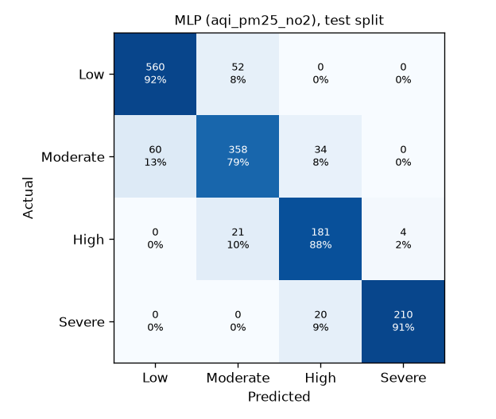

# Health-risk models: evaluation summary

Generated 2026-09-25T18:56:35+00:00. 7500 rows; stratified 80/20 train/test split; model selection by 5-fold stratified CV on the training split; test metrics from one fit on the training split. Classifiers use balanced sample weights.

Deployed: `aqi_pm25_no2` (profile + AQI, PM2.5, NO2) as the primary model and `aqi_only` as the fallback for cities without pollutant forecasts. `full` (all five pollutants) is shown for comparison.

Estimated risk for decision support only, not a medical diagnosis.

## Classification: HealthRiskLevel

Selected by mean CV f1 weighted: `aqi_pm25_no2` → **MLP**, `aqi_only` → **MLP**.

### Feature set `aqi_only` (deployed: fallback)

| Model | CV weighted F1 | ± std | Test F1 (w) | Test acc. | Test prec. (w) | Test rec. (w) | Recall Low | Recall Moderate | Recall High | Recall Severe |
|---|---|---|---|---|---|---|---|---|---|---|
| Baseline | 0.237 | 0.000 | 0.236 | 0.408 | 0.166 | 0.408 | 1.000 | 0.000 | 0.000 | 0.000 |
| Random Forest | 0.801 | 0.007 | 0.817 | 0.817 | 0.817 | 0.817 | 0.891 | 0.770 | 0.655 | 0.861 |
| XGBoost | 0.813 | 0.011 | 0.826 | 0.825 | 0.827 | 0.825 | 0.895 | 0.763 | 0.709 | 0.865 |
| **MLP** | 0.821 | 0.009 | 0.839 | 0.838 | 0.842 | 0.838 | 0.882 | 0.812 | 0.743 | 0.857 |

### Feature set `aqi_pm25_no2` (deployed: primary)

| Model | CV weighted F1 | ± std | Test F1 (w) | Test acc. | Test prec. (w) | Test rec. (w) | Recall Low | Recall Moderate | Recall High | Recall Severe |
|---|---|---|---|---|---|---|---|---|---|---|
| Baseline | 0.237 | 0.000 | 0.236 | 0.408 | 0.166 | 0.408 | 1.000 | 0.000 | 0.000 | 0.000 |
| Random Forest | 0.831 | 0.010 | 0.845 | 0.845 | 0.845 | 0.845 | 0.913 | 0.763 | 0.757 | 0.900 |
| XGBoost | 0.849 | 0.013 | 0.858 | 0.858 | 0.858 | 0.858 | 0.923 | 0.783 | 0.762 | 0.917 |
| **MLP** | 0.871 | 0.013 | 0.873 | 0.873 | 0.875 | 0.873 | 0.915 | 0.792 | 0.879 | 0.913 |

### Feature set `full`

| Model | CV weighted F1 | ± std | Test F1 (w) | Test acc. | Test prec. (w) | Test rec. (w) | Recall Low | Recall Moderate | Recall High | Recall Severe |
|---|---|---|---|---|---|---|---|---|---|---|
| Baseline | 0.237 | 0.000 | 0.236 | 0.408 | 0.166 | 0.408 | 1.000 | 0.000 | 0.000 | 0.000 |
| Random Forest | 0.818 | 0.012 | 0.835 | 0.835 | 0.836 | 0.835 | 0.900 | 0.765 | 0.723 | 0.896 |
| XGBoost | 0.848 | 0.007 | 0.859 | 0.859 | 0.860 | 0.859 | 0.915 | 0.792 | 0.782 | 0.913 |
| MLP | 0.863 | 0.012 | 0.878 | 0.878 | 0.878 | 0.878 | 0.928 | 0.792 | 0.850 | 0.939 |

## Regression: HealthRiskScore

Selected by mean CV rmse: `aqi_pm25_no2` → **MLP**, `aqi_only` → **MLP**.

### Feature set `aqi_only` (deployed: fallback)

| Model | CV RMSE | ± std | Test RMSE | Test MSE | Test MAE | Test R² | Level acc. from score |
|---|---|---|---|---|---|---|---|
| Baseline | 1.595 | 0.082 | 1.648 | 2.715 | 1.072 | -0.000 | 0.301 |
| Random Forest | 0.443 | 0.022 | 0.478 | 0.229 | 0.267 | 0.916 | 0.835 |
| XGBoost | 0.406 | 0.017 | 0.427 | 0.182 | 0.242 | 0.933 | 0.840 |
| **MLP** | 0.378 | 0.012 | 0.377 | 0.142 | 0.242 | 0.948 | 0.839 |

### Feature set `aqi_pm25_no2` (deployed: primary)

| Model | CV RMSE | ± std | Test RMSE | Test MSE | Test MAE | Test R² | Level acc. from score |
|---|---|---|---|---|---|---|---|
| Baseline | 1.595 | 0.082 | 1.648 | 2.715 | 1.072 | -0.000 | 0.301 |
| Random Forest | 0.375 | 0.024 | 0.403 | 0.162 | 0.225 | 0.940 | 0.858 |
| XGBoost | 0.273 | 0.024 | 0.296 | 0.087 | 0.162 | 0.968 | 0.887 |
| **MLP** | 0.199 | 0.005 | 0.198 | 0.039 | 0.147 | 0.986 | 0.870 |

### Feature set `full`

| Model | CV RMSE | ± std | Test RMSE | Test MSE | Test MAE | Test R² | Level acc. from score |
|---|---|---|---|---|---|---|---|
| Baseline | 1.595 | 0.082 | 1.648 | 2.715 | 1.072 | -0.000 | 0.301 |
| Random Forest | 0.384 | 0.029 | 0.413 | 0.171 | 0.230 | 0.937 | 0.863 |
| XGBoost | 0.274 | 0.022 | 0.294 | 0.087 | 0.165 | 0.968 | 0.886 |
| MLP | 0.215 | 0.007 | 0.232 | 0.054 | 0.163 | 0.980 | 0.863 |

## Boundary rule (test split)

The classifier gives the headline level. When the predicted score (cut at [1.0, 1.8, 2.8]) implies a different level, the day is flagged *borderline*, shown as a range (e.g. Moderate-High), and the higher level is used for alerts (hospital map, precautions).

| | `aqi_pm25_no2` | `aqi_only` |
|---|---|---|
| Days flagged borderline | 6.8% | 8.3% |
| Level accuracy when models agree | 89.8% | 86.9% |
| Level accuracy when borderline | 52.0% | 49.2% |
| True level inside the shown range (borderline days) | 74.5% | 71.8% |
| High/Severe caught: classifier alone | 95.2% | 90.8% |
| High/Severe caught: alert level | 95.9% | 93.3% |
| Low/Moderate alerted as High+: classifier alone | 3.2% | 2.7% |
| Low/Moderate alerted as High+: alert level | 3.8% | 3.6% |

## Confusion matrix (selected `aqi_pm25_no2` classifier, test split)

